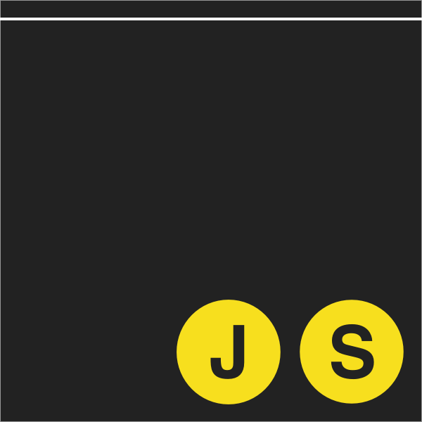

BrooklynJS
==========

## The world's most popular programming language, in New York's most popular borough ##

[BrooklynJS](brooklynjs.com) is a monthly meeting of JavaScript developers which happens on the third Thursday of each month in the upstairs event space at [61 Local](http://www.61local.com/), a restaurant and bar in Cobble Hill, Brooklyn. Each month, a handful of presenters give short talks about cool technology projects, and there's usually also a musical guest performing in between.

Tickets cost $15 and are released in two batches, both on Fridays at 10am one and two weeks before the event. They usually sell out very quickly. [Follow @brooklyn_js on Twitter](http://twitter.com/brooklyn_js) for timely notifications about tickets, amid other blatherings.

This repository serves two primary purposes:

1. Talks are proposed via Git pull requests; just add your talk to <a href="index.html">index.html</a>. Anybody who proposes a talk gets early priority access to ticket sales for that month regardless of whether the talk is accepted.

1. For accounting purposes, [budget.js](budget.js) contains an exhaustive historical log of all funds raised. All proceeds are donated to worthwhile charities, notably including [ScriptEd](https://www.scripted.org/).

Brooklyn is obviously cooler, but nonetheless, you might also be interested in [QueensJS](http://www.meetup.com/QueensJS/), [ManhattanJS](http://manhattanjs.com/), and [JerseyScript](http://jerseyscript.github.io/).

Hope to see you next time!
